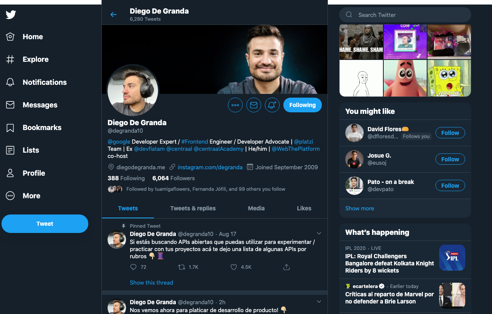
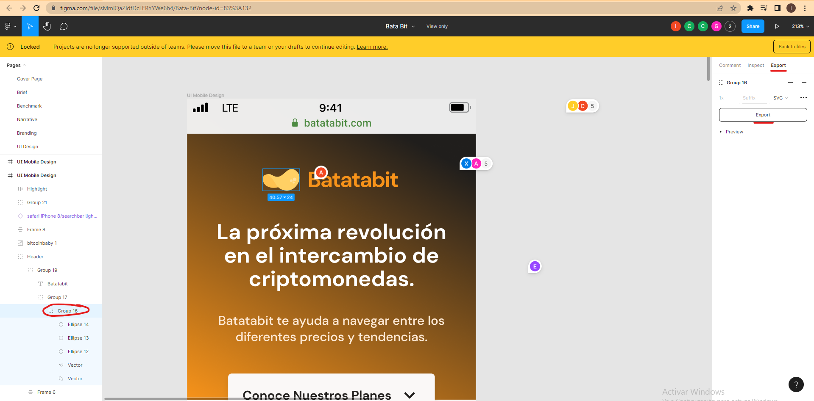
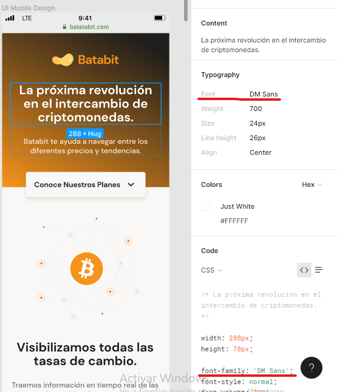
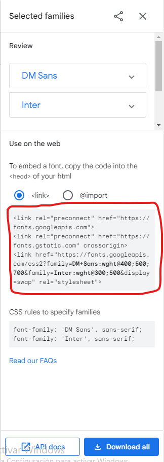
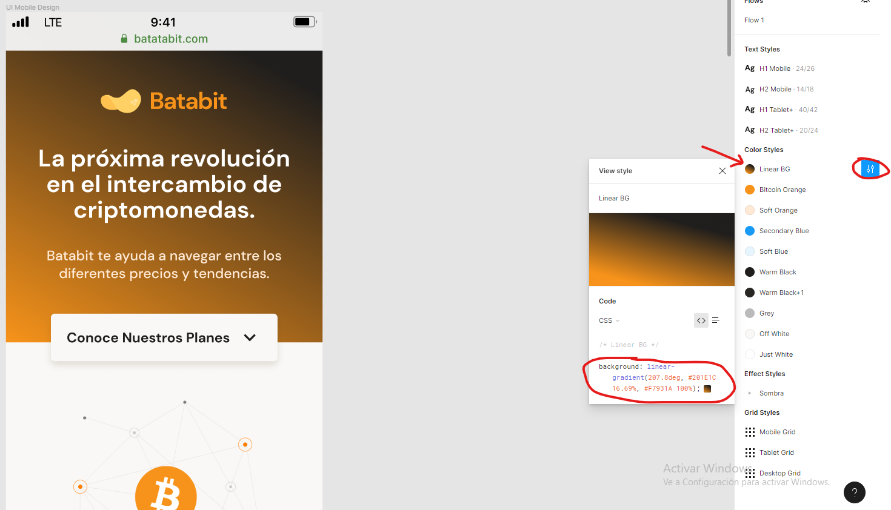

# ¿Quiénes se ven beneficiados?

## Para desarrolladoras y desarrolladores: escalar es más sencillo

Pasar un desarrollo con vista de escritorio a móvil requiere de realizar diversas consideraciones, puede tornarse complejo pues además esto implica tener que eliminar elementos de la vista y generalmente es más fácil añadirlos.

Mobile First por el contrario hace de esta experiencia algo más llevadero y a nivel del código es bastante sencillo pasar de móvil a vistas más grandes, con la oportunidad de colocar componentes adicionales en el proceso.

## Para usuarios: menos es más y para más personas

Sí, es cierto que cada vez es mayor la cantidad de personas navegando en dispositivos móviles y es que Mobile First no solo llega a más dispositivos por la enorme variedad de vistas disponibles en el mercado, sino también a más personas.

La simplicidad en el diseño también ayuda a que tu comunicación sea efectiva hacia tus usuarios, brindando una experiencia de navegación agradable y que junto a un diseño accesible tu alcance aumente considerablemente.

Esto también añade valor a tus usuarios con una velocidad de conexión limitada y/o dispositivos de gama baja.

## Para negocios: mejor posicionamiento en buscadores

Google comenzó trabajar a inicios de 2018 con un algoritmo que otorga de mayor relevancia a aquellos sitios optimizados para móviles. Esto no afectará a aquellos sitios que tengan una versión de escritorio y móvil, pero sí penalizará a los que carezcan de una alternativa móvil.

Para fines de SEO esto puede significar un menor rebote de usuarios si el contenido es lo suficientemente atractivo para retener la atención de los usuarios.

## Evolución progresiva

Así como avanza la tecnología también podemos apreciar los cambios en tendencias del desarrollo frontend que incluso llegan a convertirse en estándares, como ha sido Mobile First.

Primero desarrollamos para escritorio donde nuestro sitio web podía consumirse desde una computadora de escritorio y monitores en laptops. Después surgió la necesidad de adaptar estos sitios a dispositivos portátiles como teléfonos inteligentes y tablets.

Al aumentar el consumo de sitios en dispositivos móviles surgió la necesidad de desarrollar primero para estos y después escalar a otras pantallas más grandes. Esta evolución ha llevado al punto en que algunos servicios estén disponibles cómo mobile-only, donde la única forma de consumirlos es desde un dispositivo móvil como el caso de aplicaciones financieras, de entregas a domicilio y otras más.

## Twitter como caso de estudio

Esta popular red social ha pasado por diversas transformaciones en su diseño y una de las más importantes es su visualización desde diversos dispositivos.

Analizando estas capturas de pantalla podrás apreciar como desde la vista móvil se mantiene bastante simplificado, conforme aumenta se le añaden otros elementos y conserva otros en común.

Vista en móvil (iPhone X)


Vista en navegador de escritorio


Vista reducida en navegador de escritorio


## Conclusión

Ahora sabes cuál es la razón por la que este estándar es tan importante actualmente en tus conocimientos como desarrolladora o desarrollador web. Además de que estás asegurándote de que tus sitios lleguen a más dispositivos y personas, también estás haciendo que tu código sea más fácil de escalar y de hacer modificaciones en el futuro.

## Arquitectura Inicial

Nosotros usaremos como guia el siguiente diseño [aqui](https://www.figma.com/file/sMmlQaZldfDcLERYYWe6h4/Bata-Bit?node-id=44%3A593). Para empezar tenemos que analizar el diseño dividiento en partes como header , main , footer , etc.

Creamos un index.html y colocamos las partes correspondientes del diseño:

```HTML
<body> 
    <header></header>
    <main>
        <section></section>
        <section></section>
        <section></section>
        <section></section>
    </main>
    <footer></footer>
</body>
```

Este seria nuestro codigo inicial.

## Descargar las imagenes e iconos en fitma

Es importante que al momento de descargar imagenes tengas que dividirlas en varias carpetas, ejemplo la carpeta imagenes/icons y otra para imagenes/img



## Obtener Font

El programa Figma al seleccionar un texto nos permite obtener su font



Una vez que ya tenemos el nombre vamos a [Google Font](https://fonts.google.com/) y buscamos el font correspondiente
en este caso seria DM Sans. Luego entramos a Figma y buscamos que font-Weight esta usando. En mi caso descargaria los fonts con weight 400,500 y 700.

Para agregarlo copiamos el link que nos da google fonts y lo agregamos al head de nuestro html.



## Estilos Base

En figma nos dara los colores del diseño, para asi despues agregarlos en nuestras variables de css. 



Creamos las variables en css

```CSS
/*Variables*/
:root {
    /* colores */
    --bitcoin-orange: #f7931a;
}
```

## Media Queries

Nos aseguramos que nuestro diseño mobile first pueda ser compatible en cualquier tamaño cagantizando una buena experiencia al usuario.

Inciamos creando una carpeta nueva de estilos creando un nuevo archivo de la dimension que vamos a modificar por ejemplo tablet.css. 

Luego agremos a nuestro html el archivo table.css y quedaria asi 

```HTML
<head>
    ...

    <link rel="stylesheet" href="./style.css">
    <link rel="stylesheet" href="./css/tablet.css">
</head>
```

Pero si abrimos la pagina desde un celular se cargaria tambien el archivo de tablet, probocaria que la pagina se ponga lenta ya que tiene que cargar dos estilos.
Para ello existe los media queries :

```HTML
...
<head>
    <link rel="stylesheet" href="./style.css">
    <link rel="stylesheet" href="./css/tablet.css" media="(min-width: 930px)">
</head>
```